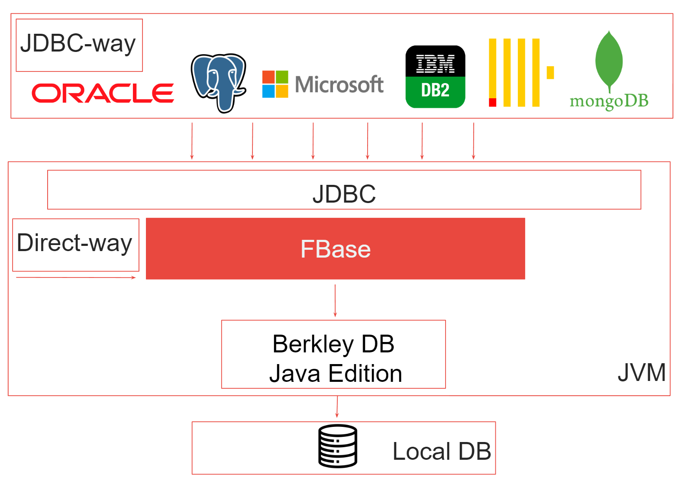
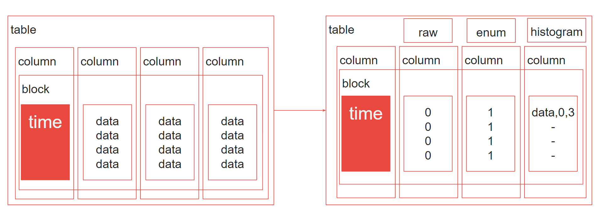

# FBase


Hybrid time-series column storage database engine written in Java

## Table of contents

- [Architecture](#architecture)
- [Prerequisites](#prerequisites)
- [Build](#build)
- [Usage](#usage)
- [Downloads](#downloads)
- [Development](#development)
- [License](#license)
- [Contact](#contact)

## Architecture

### High level architecture


The main APIs for writing and reading data from the database are located in the **FStore** interface.

The following **Write** modes are used to save data in **FBase**:
- **Direct** - direct data insertion;
- **JDBC** - incremental data insertion using JDBC;
- **JDBC Batch** - batch data loading using JDBC;
- **CSV** - loading data from a CSV file (experimental API).

The following **Read** APIs are available in **FBase**:

- **Stacked** - calculation of data distribution by table column, the result of the COUNT aggregate function in SQL;
```
SELECT trip_type, COUNT(trip_type)
        FROM datasets.trips_mergetree
        WHERE toYear(pickup_date) = 2016
        GROUP BY trip_type
```

- **Gantt** - calculation of overlapping data distribution by two table columns, the result of the COUNT aggregate function in SQL;
```
SELECT trip_type, pickup_boroname, COUNT(pickup_boroname)
                  FROM datasets.trips_mergetree
                  WHERE toYear(pickup_date) = 2016
                  GROUP BY trip_type, pickup_boroname
```

- **Raw** - retrieval of raw data in tabular form. For a selected column or all data from the table.

Before saving data, you need to specify the table storage parameters (the table name **tableName** is mandatory) 
and column metadata in the **SProfile** object (if necessary), and load them into the **FBase** metadata store 
using the **loadJdbcTableMetadata** API for storing time-series data tables or the **loadCsvTableMetadata** API 
for regular heap tables. Then, you can access the data using the table name. Examples of working with the metadata storage API can be found in the unit tests.
```
public class SProfile {

  private String tableName;
  private TType tableType = TType.TIME_SERIES;
  private IType indexType = IType.GLOBAL;
  private Boolean compression = Boolean.FALSE;
  private Map<String, CSType> csTypeMap;
}
```

**FBase** is designed for storing time series data, for this purpose in **SProfile** it is necessary to specify the value **TIME_SERIES** for the **tableType** field. 
It also supports storing data in regular tables, for this purpose it is necessary to use the value **REGULAR** and load data through the **CSV** API.

**FBase** supports two types of indexing (field **indexType**):
- **Global** - when the data storage format is specified at the table level, using **csTypeMap**;
- **Local** - at the block level, when the decision to use a specific type of storage (**RAW**, **ENUM**, or **HISTOGRAM**) is made based on the distribution of data in the collected datasets automatically.

Data in **FBase** can also be compressed, for this purpose the corresponding boolean value for the **compression** field must be set in the table settings.

The configuration of the database table allows switching between global and local indexing, enabling and disabling data compression "on the fly". 
This is achieved through placing the storage type metadata in the block header for both types of indexing and a flag for enabling or disabling compression.

[Return to Table of Contents](#table-of-contents)

### Data format


Three data storage formats are supported:
- **RAW** - when data is stored as an identifier of a Java type **int** value;
- **ENUM** - when data is stored as an identifier of a Java type **byte** value;
- **HISTOGRAM** - when only the data, start, and end index of the data appearance in the column are saved.

The metadata of the storage format, indexing type, and compression are stored in the block header.

[Return to Table of Contents](#table-of-contents)

## Prerequisites
**FBase** is Java 17+ compatible and ships with a small bunch of dependencies

[Return to Table of Contents](#table-of-contents)

## Build
Ensure you have JDK 17+, Maven 3 and Git installed
  ```shell
    java -version
    mvn -version
    git --version
  ```

Get the source codes of the FBase repository:
  ```shell
    git clone https://github.com/real-time-intelligence/fbase.git
    cd fbase
  ```

To build run:
  ```shell
    mvn clean compile
  ```

To build and install **FBase** artifact to local mvn repository run:
  ```shell
    mvn clean install
  ```

[Return to Table of Contents](#table-of-contents)

## Usage
Add **FBase** as a dependency in the settings file pom.xml of your Maven project:

```xml
<dependency>
    <groupId>ru.real-time-intelligence</groupId>
    <artifactId>fbase</artifactId>
    <version>0.3.0</version>
</dependency>
```

You can find a complete list of examples on how to use FBase in your application in the module and integration tests.

Note: Library published on [Maven Central](https://central.sonatype.com/artifact/ru.real-time-intelligence/fbase/)

[Return to Table of Contents](#table-of-contents)

## Downloads
Current version is available on [GitHub](https://github.com/real-time-intelligence/fbase/releases/) or [Maven Central](https://central.sonatype.com/artifact/ru.real-time-intelligence/fbase/)

[Return to Table of Contents](#table-of-contents)

## Development
If you found a bug in the code or have a suggestion for improvement, please create an [issue](https://github.com/real-time-intelligence/fbase/issues/) on GitHub.

Before starting work, it is necessary to check the [Build](#build)

It is also necessary to check the successful completion of unit tests
  ```shell
    mvn clean test
  ```

To check the correctness and performance of the **Write** and **Read** API FBase, integration tests are used based on test data of taxi orders in New York City.

To run the integration tests, you need to:
- Install ClickHouse database on your local PC using Docker;
- Load the test data [the New York taxi data](https://clickhouse.com/docs/en/getting-started/example-datasets/nyc-taxi/) into the local ClickHouse instance;
- Check the connection to the ClickHouse on your local PC using the URL **"jdbc:clickhouse://localhost:8123"** or use another one and make similar changes in the tests;
- Create a directory to store the **FBase** test data **"C:\\Users\\.temp"**;
- Load the test data into the **FBase** using any of the methods presented in **FBaseCHLoadDataTest**;
- Run the integration tests in **FBaseCHQueryDataTest**.

Note: The integration tests use the **@Disabled** annotation, if necessary, it should be removed for the correct loading of data and checks.

[Return to Table of Contents](#table-of-contents)

## License
[](https://opensource.org/licenses/Apache-2.0)
Code released under the Apache License Version 2.0

[Return to Table of Contents](#table-of-contents)

## Contact
Created by [@akardapolov](mailto:akardapolov@gmail.com) - feel free to contact me!

[Return to Table of Contents](#table-of-contents)