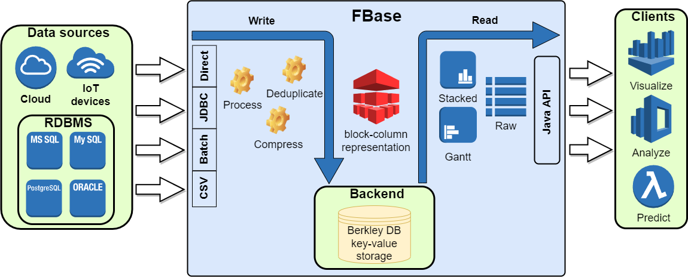
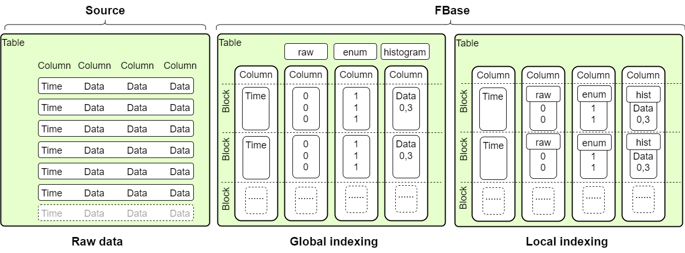

# FBase


Hybrid time-series column storage database engine written in Java

## Table of contents

- [Architecture](#architecture)
- [Prerequisites](#prerequisites)
- [Build](#build)
- [Usage](#usage)
- [Development](#development)
- [Downloads](#downloads)
- [License](#license)
- [Contact](#contact)

## Architecture

### High level architecture


Data can be loaded directly through **putDataDirect** method or using JDBC by **putDataJdbc** or **putDataJdbcBatch** API methods in **FStore** interface

### Data format


Three column format type supported: **RAW**, **ENUM** and **HISTOGRAM**
- **RAW** store data using Java **int**
- **ENUM** store data using Java **byte**
- **HISTOGRAM** store actual value, start and the end index in column data

## Prerequisites
FBase is Java 17+ compatible and ships with a small bunch of dependencies

## Build
Ensure you have JDK 17, Maven 3 and Git installed

    java -version
    mvn -version
    git --version

Clone the FBase repository:

    git clone https://github.com/real-time-intelligence/fbase.git
    cd fbase

To build run:

    mvn clean compile

To build and install FBase artifact to local mvn repository run:

    mvn clean install

## Usage
Add FBase as dependency to your pom.xml:

```xml
<dependency>
    <groupId>ru.real-time-intelligence</groupId>
    <artifactId>fbase</artifactId>
    <version>0.1.2</version>
</dependency>
```

Note: Library published on [Maven Central](https://search.maven.org/)

How to use FBase in your Java code?
- Start point is FStore interface - here the full list of API you can use
- Everything you want to know about practical usage of FBase API resides in the tests

To run unit tests:

    mvn clean test

To run integration test:
- Install ClickHouse locally with Docker or use another way
- Get [the New York taxi data](https://clickhouse.com/docs/en/getting-started/example-datasets/nyc-taxi/) and load it to your ClickHouse server
- Use default ClickHouse connection url **"jdbc:clickhouse://localhost:8123"** or change it in the tests
- Create temp folder **"C:\\Users\\.temp"** or use another one (see **initialLoading** method in the integration test)
- Load taxi data to FBase using **loadDataTest** or **loadDataBatchTest** methods in **FBaseCHLoadDataTest**
- Run integration tests using **FBaseCHQueryDataTest**

Note: Bear in mind **@Disabled** annotation for **FBaseCHLoadDataTest** and **FBaseCHQueryDataTest**

## Downloads
Current version is available on releases

## Development
Have a bug or a feature request? Please open an issue!

## License
[](https://opensource.org/licenses/Apache-2.0)
Code released under the Apache License Version 2.0

## Contact
Created by [@akardapolov](mailto:akardapolov@gmail.com) - feel free to contact me!